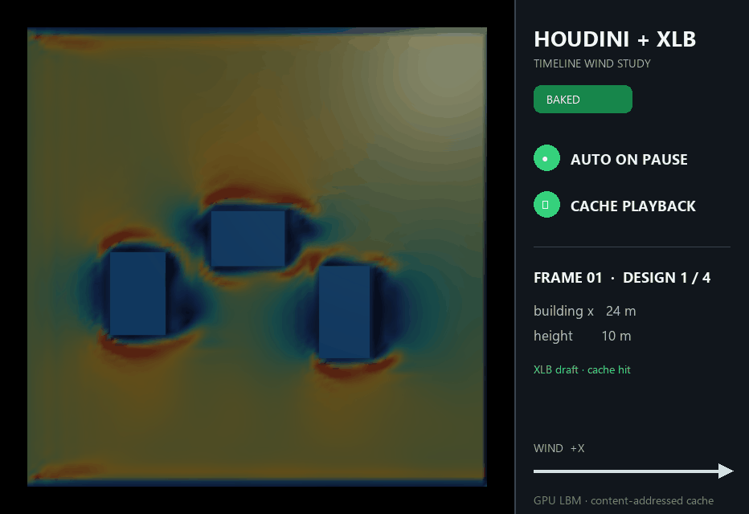

# Houdini × XLB

Houdiniで編集・アニメーションした建物や街区形状を、Solver SOPから
プロジェクト側のPython 3.12環境へ送り、XLB（GPU Lattice-Boltzmann）の
風速場をHoudiniへ戻す連携層です。`Prev_Frame`がフレームごとの風速場と
解析状態を運び、停止中は自動解析、再生中はベイク済み結果だけを表示します。
Houdini同梱PythonへWarp/XLBを直接インストールしないことが重要な設計判断です。

公開デモは、中央広場の風環境を改善しつつ中央通風帯を維持する、意図的に小さな
配置最適化です。青い2棟の中心位置4変数を各2水準とし、固定容積・敷地内・
非重複の16候補を**すべて実XLBで評価**します。目的関数は、黄色の広場内で
例示的な快適域 `0.55 <= U/Uin <= 1.20` を外れるセルの割合です。シアンの
通風帯平均を初期案の95%以上に保つことをハード制約にしています。

同梱のstudy解析（96 × 96 × 38、2400 step、歩行者高さ1.5 m）では、快適域内の広場セルが`30.8% → 100.0%`、通風帯が
`190.2%`となり、全16候補中の大域最良解は評価6で見つかります。タイムラインは
評価1、3、5、11と探索完了16におけるbest-so-farだけを再生します。快適域はUIと
最適化ループを説明するための仮設定です。この結果は格子独立性、境界条件、
複数風向、実測または別ソルバーで検証しておらず、風環境の認証・適否判定には使えません。

## 対応環境

- Windows native（WSL不要）
- NVIDIA CUDA GPU
- Houdini Indie 20.5 / Python 3.11（20.5.684で確認済み）
- 外部Python 3.12
- uvとGit

CPUのみ、AMD GPU、Linux、macOSは現時点では未検証です。

## GitHubからcloneした場合のインストール

リポジトリ直下で実行します。

    uv venv .venv --python 3.12
    $env:PYTHONUTF8=1
    uv pip install --python .venv\Scripts\python.exe -e ".[xlb,dev]"
    .venv\Scripts\python.exe scripts\smoke_worker.py

XLBは動作確認済みcommitを指定し、warp-langは1.10.0に固定します。
Houdini側へ必要なのはnumpyと軽量クライアントだけで、GPU workerは上記環境です。

このモノレポ内で開発する場合は、ルートのPython 3.12環境を使用できます。

    uv pip install --python .venv\Scripts\python.exe -e "projects\houdini-xlb[xlb,dev]"

モノレポの既存環境では external/XLB のeditable installも利用できます。

## サンプルHIP

最小サンプルは [examples/houdini_xlb_demo.hip](examples/houdini_xlb_demo.hip) です。
`building0`と`building1`が最適化対象、`building2`と`building3`が固定棟です。
フレーム1、31、61、91、120に探索のbest-so-far配置をconstant keyで保存し、
中間形状を設計案として誤表示しません。全棟の寸法・高さ・容積は固定です。
HIP生成時に最適化JSON、候補配置、最小4 mの平面離隔、95%通風制約を検査します。

1. `xlb_solver` Solver SOPを選択します（同梱HIPはstudy、手動編集時はdraftも選択可）。
2. タイムラインを停止してスクラブすると、0.75秒後に現在案を自動解析します。
3. `Bake Range`を押すと、1–120の未解析形状をバックグラウンドで順番に解析します。
4. 再生中はベイク済みフレームだけが表示され、XLBジョブは新規起動しません。

`Run Now (Current Frame)`は、自動解析を待たず現在案を直ちにキューへ入れる
任意の操作です。通常の形態スタディで毎回押す必要はありません。

同梱HIPは生成PCの絶対パスを保存しません。HIP位置から上位ディレクトリを検索して
`src/houdini_xlb`と`.venv/Scripts/python.exe`を実行時に解決し、cacheは既定で
リポジトリ内の`artifacts/cache/xlb`へ保存します。したがって標準配置なら、
clone後にHIPを再生成せず開けます。

別の場所へ仮想環境、source、cacheを置く場合は、Houdiniを起動する前に指定します。

    $env:HOUDINI_XLB_PYTHON = "C:/path/to/python.exe"
    $env:HOUDINI_XLB_SOURCE = "C:/path/to/houdini-xlb/src"
    $env:HOUDINI_XLB_CACHE = "D:/cache/houdini-xlb"

同梱の最適化を再計算し、HIP内の形状や説明も再生成する場合だけ次を実行します。

    $env:PYTHONUTF8=1
    .venv\Scripts\python.exe scripts\optimize_demo.py
    $HYTHON = "C:\Program Files\Side Effects Software\Houdini 20.5.xxx\bin\hython.exe"
    & $HYTHON houdini\build_demo_hip.py --run-xlb-smoke

Pythonコマンドは16候補を再評価して最適化JSONを更新します。既存の同梱結果を
そのまま表示するだけなら省略できます。

Steam版などHoudiniの場所が異なる場合は、`$HYTHON`だけ変更します。
`--python-executable`と`--cache-dir`はbuild時のsmoke検査用で、生成PCの
絶対パスをHIPへ埋め込むoptionではありません。

    & $HYTHON houdini\build_demo_hip.py --python-executable C:\path\to\python.exe

生成先の既定値は`examples/houdini_xlb_demo.hip`です。GUIで開くと、停止中の
現在フレームをデバウンス後に自動解析します。自動起動したくない場合は
`Auto Analyze on Pause`をオフにできます。HythonにはUIイベントループがないため、
`--run-xlb-smoke`だけは同期的に1案を検査します。

READMEのGIFも、実際のHoudini geometryとXLB結果からCLIで再生成できます。

    uv pip install --python .venv\Scripts\python.exe -e ".[xlb,demo]"
    .venv\Scripts\python.exe scripts\make_readme_gif.py --hython $HYTHON

このコマンドは、16候補のXLB全探索、最適化JSON生成、Houdini OpenGLレンダー、
GIF合成までを実行します。GIFの5枚は評価1、3、5、11、16時点のbest-so-farで、
風速場の画像補間はしていません。色尺度は全案で`0–2 U/Uin`に固定します。
小さな再現可能データは
[examples/houdini_xlb_demo_optimization.json](examples/houdini_xlb_demo_optimization.json)、
中間PNGとXLBキャッシュは`artifacts/readme-demo/`と`artifacts/cache/xlb/`に
保存されます。後者はGitに含まれません。

## タイムラインとキャッシュ

このサンプルのフレーム番号は流体の時間刻みではなく、最適化のbest-so-far
マイルストーンです。
キャッシュキーはフレーム番号ではなく、正規化高さマップ・解析設定・キャッシュ
versionのSHA-256です。同じ形状が複数フレームに現れる場合、解析結果を共有します。

- 停止／スクラブ: 最新の形状だけを残し、デバウンス後に非同期解析
- 再生: exact cache hitだけを表示し、未ベイク案は灰色の`not-baked`表示
- Bake Range: 未キャッシュのユニーク形状を単一workerで順次解析
- Cancel Bake: 実行中の1件は完了させ、残りの投入を停止

Houdini内の構成は実際のSolver SOPです。

    ground → xlb_init → xlb_solver → xlb_result → study_display
                   ↗       ↑             ↖             ↑
          current buildings └─ input 2 ─ current buildings   plaza / vent guides

    xlb_solver/d/s:
        Prev_Frame ─→ xlb_step ─→ OUT
        Input_2    ────────↗

`xlb_solver`のSimulation Cacheには、建物を除いた風速グリッドとdetail stateが
フレームごとに保持されます。`xlb_result`は現在フレームの建物だけを後段で合成するため、
過去フレームの建物が累積しません。`study_display`は、解析入力には含めない
測定領域の枠線だけをさらに合成します。`Reset Simulation`はSolverのフレーム状態を消しますが、
形状・設定のSHA-256で保存したXLBのNPZキャッシュは再利用されます。範囲ベイク完了時も
Simulation Cacheを一度リセットし、次のforward再生でNPZから正しいSolver stateを再構築します。

Solver stateと`xlb_result`のdetail attribute `xlb_status`、`xlb_job_state`、
`xlb_frame`、`xlb_previous_cache_key`、`xlb_bake_done`、`xlb_bake_total`で
状態を確認できます。

## 処理の流れ

    Houdini timeline / geometry
        → connected-piece rasterization
        → height-map request
        → Solver SOP / Prev_Frame state
        → debounce / latest-only external job queue
        → persistent Python 3.12 worker
        → XLB / NVIDIA Warp
        → atomic NPZ cache
        → speed field + metadata
        → Houdini visualization

ワーカーを常駐させるので、Python・Warpの起動費用は最初の1回だけです。
同じ形状・設定はSHA-256キーでキャッシュされます。

## 解析プロファイル

| profile | grid | steps | 用途 |
|---|---:|---:|---|
| draft | 96 × 96 × 38 | 300 | 停止・スクラブ時の短時間確認 |
| preview | 128 × 128 × 51 | 600 | 対話的な比較 |
| study | 96 × 96 × 38 | 2400 | 同梱デモの再現可能な全候補比較 |
| quality | 256 × 256 × 102 | 2500 | 高解像度の候補確認（収束保証ではない） |
| custom validation | CLIで明示 | CLIで明示 | 格子・時間・境界感度の実験 |

既定profileは100 m × 100 m × 40 mの物理領域、基準高さ10 m、結果高さ1.5 mを
使用します。高さマップ値は鉛直領域高さに対する比であり、入力形状はXLBのxy格子へ
直接ラスタライズします。別解像度の高さマップをbackend内部で拡大する処理はありません。
x・y・zセルはほぼ立方体とし、1.5 m面は隣接z sliceを線形補間します。旧座標契約の
キャッシュはbackend署名とcache versionにより再利用されません。

通常のHoudini解析profileはKBC衝突モデル、床・上面・側面のno-slip壁、一定速度流入を
使います。検証CLIだけはAIJ平均流入にfitしたべき乗則と一様基準流による初期化を使い、
`--collision-model` でKBCとSmagorinsky LES-BGKを明示的に比較できます。これは感度試験で、
対話profileの既定モデルを自動で切り替えるものではありません。大気境界層の流入乱れ、
粗度、上空・側方開境界、十分な周辺paddingは未実装です。
したがってprofile名は計算量の段階を表すだけで、工学的妥当性や収束を保証しません。

XLBの所要時間はGPU、格子、収束・平均化条件に依存します。したがって
draftであっても「再生速度でCFDを解く」のではなく、「停止中に非同期解析し、
再生時はキャッシュを読む」方式です。
滑らかな編集中表示には、既存のFNOプレビューを併用します。

## CLIで高さマップを解析

.npy、または高さマップを含む.npzを入力できます。入力shapeは選択profileの
(grid_y, grid_x)と完全一致し、値はbuilding_height_m / domain_height_mです。

    $env:PYTHONUTF8=1
    .venv\Scripts\houdini-xlb.exe input_heightmap.npy --profile preview --cache artifacts\houdini\cache\xlb --out outputs\houdini_xlb_preview.npz

格子・step・Reynolds数・平均化条件は、各profileを基準にCLI optionで上書きできます。

結果には速度場、正規化高さマップ、解析設定、キャッシュキー、実行時間が
含まれます。

## Houdini Pythonから呼ぶ

Houdini側は軽量クライアントだけを読み込みます。入力ジオメトリには
connected pieceごとの整数point attribute class が必要です。

    from houdini_xlb.houdini import analyze_geometry

    node = hou.pwd()
    result = analyze_geometry(
        node.inputs()[0].geometry(),
        profile="preview",
        cache_dir=hou.text.expandString("$HIP/../artifacts/cache/xlb"),
    )
    speed = result.speed

XlbWorkerClient.analyze_async() を使えば、Houdini UIを止めずに要求できます。
表示更新はHoudiniのメインスレッドへ戻して行ってください。

最小デモHIPを再生成:

    & $HYTHON houdini\build_demo_hip.py

初回の実XLB接続まで検査する場合は末尾に --run-xlb-smoke を付けます。

生成された`examples/houdini_xlb_demo.hip`を開き、タイムラインを停止して
建物またはフレームを編集します。未キャッシュ形状は灰色表示になり、デバウンス後に
`queued → running → current`へ更新されます。先に`Bake Range`を完了すれば、
タイムラインをそのまま設計案比較として再生できます。

Houdiniを介さず、同じ常駐workerと実XLBを確認:

    $env:PYTHONUTF8=1
    .venv\Scripts\python.exe projects\houdini-xlb\scripts\smoke_worker.py

## 外部風の検証

AIJの公開風洞データ Case A（1:1:2の単体建物）に対して、格子・平均時間を変えながら
3D平均速度場を186測点で比較する検証CLIを同梱しています。引数なしではGPUを回さず、
計算規模のplanだけを作ります。

    $env:PYTHONUTF8=1
    .venv\Scripts\houdini-xlb-validate.exe --cells-per-b 8,12,16
    .venv\Scripts\houdini-xlb-validate.exe --run --cells-per-b 8,12,16 --time-check
    .venv\Scripts\houdini-xlb-validate.exe --run --cells-per-b 6,8 --collision-model SmagorinskyLESBGK --time-check

既存の対話profileとは別に、AIJ平均流入を近似するべき乗則、空領域での実到達流入、
3D場キャッシュ、測点補間、格子・時間収束gateを使います。流入乱れと境界条件感度は
まだ未解決なので、全gate通過時も結果は `provisional_pass` です。2026-07-20の初期screeningは
Smagorinskyで発散を抑えましたが `provisional_fail` であり、検証済みではありません。条件、
実測した誤差、計算量、制約は[検証プロトコル](docs/VALIDATION.md)を参照してください。

## 公開境界

このプロジェクトとして切り出す対象:

- src/houdini_xlb
- package内の高さマップXLB backend
- 最小のHoudiniサンプルHIP／Solver SOP
- worker/cache/Solver timeline scheduler/rasterizationのCPUテスト

FNOの学習実験、木密更新ロジック、OpenFOAM比較はこの配布物へ含めません。
このリポジトリはMIT Licenseです。XLB本体はApache-2.0です。
